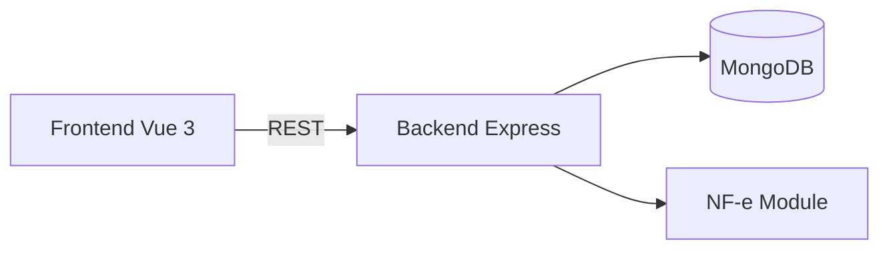
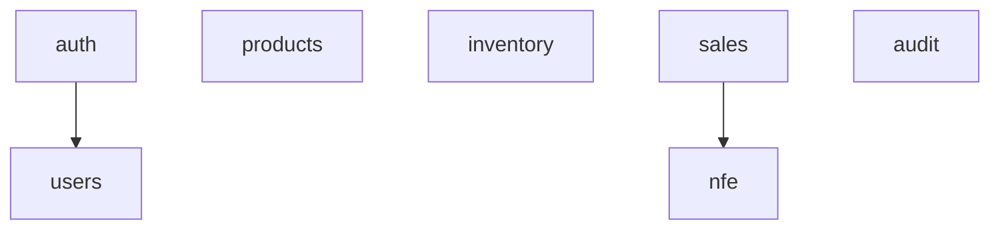

# Diagramas

## Visao geral

```mermaid
flowchart LR
  UI[Frontend Vue 3] -->|REST| API[Backend Express]
  API --> DB[(MongoDB)]
  API --> NFE[NF-e Module]
```

## Modulos do backend

```mermaid
flowchart TB
  Auth[auth] --> Users[users]
  Products[products]
  Inventory[inventory]
  Sales[sales] --> Nfe[nfe]
  Audit[audit]
```
