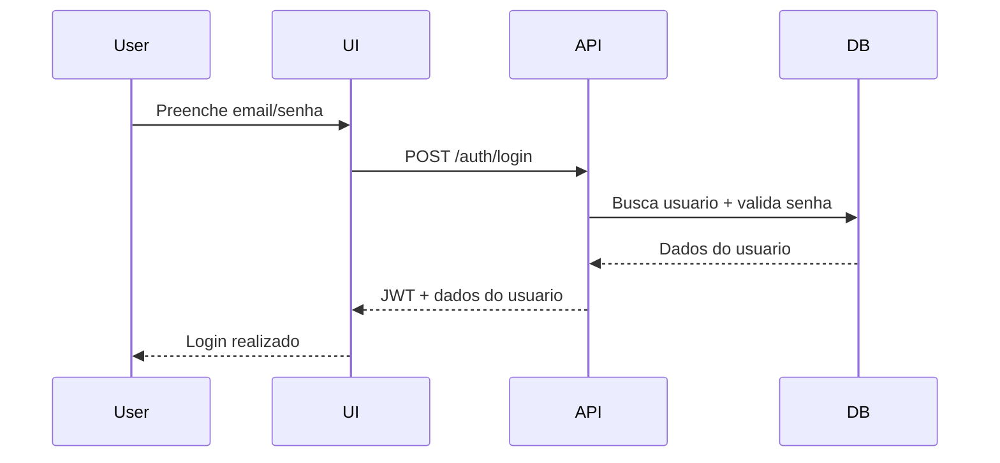
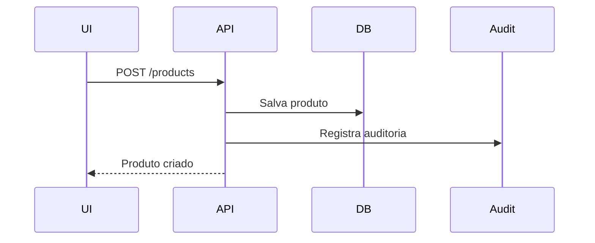
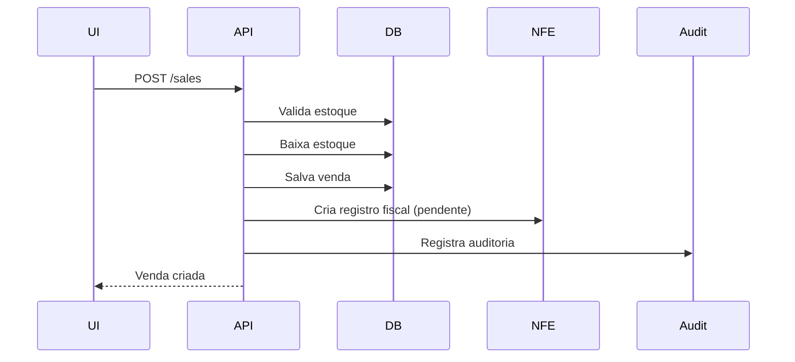

# Fluxos principais

## Login

```mermaid
sequenceDiagram
  participant User
  participant UI
  participant API
  participant DB

  User->>UI: Preenche email/senha
  UI->>API: POST /auth/login
  API->>DB: Busca usuario + valida senha
  DB-->>API: Dados do usuario
  API-->>UI: JWT + dados do usuario
  UI-->>User: Login realizado
```

## Cadastro de produto

```mermaid
sequenceDiagram
  participant UI
  participant API
  participant DB
  participant Audit

  UI->>API: POST /products
  API->>DB: Salva produto
  API->>Audit: Registra auditoria
  API-->>UI: Produto criado
```

## Criacao de venda

```mermaid
sequenceDiagram
  participant UI
  participant API
  participant DB
  participant NFE
  participant Audit

  UI->>API: POST /sales
  API->>DB: Valida estoque
  API->>DB: Baixa estoque
  API->>DB: Salva venda
  API->>NFE: Cria registro fiscal (pendente)
  API->>Audit: Registra auditoria
  API-->>UI: Venda criada
```
